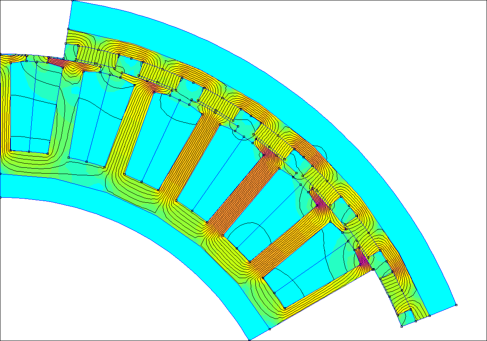
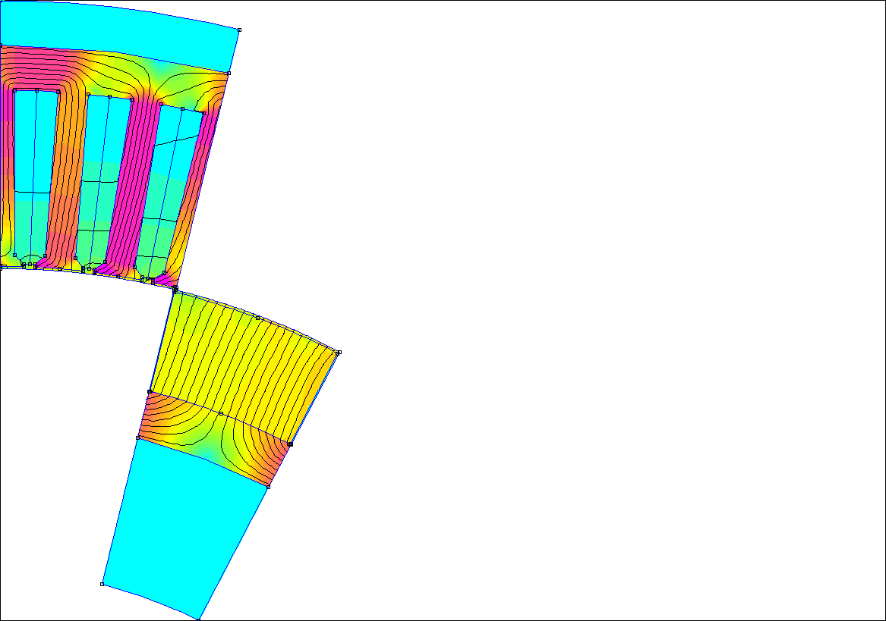

# Motor-Optimization

Work in progress fork for FEMM and MATLAB based parameterized motor geometry simulation.

## Updates for own use

- The geometry declaration should be more straight-forward and allows full motor geometry as shown in the following simulations. See the geometries added in `/motor_geometries` for examples;
- The main usable script at this point is `simulate_back_emf.m` which allows to simulate the back-emf (and many more variables) of a motor with a given geometry and winding configuration.
- As I have been this on Linux + Wine which is not officially supported by FEMM and (very) prone to crashes, I made the script `simulate_back_emf.m` overly fail-safe. It saves the simulation state at every simulation step and will automatically resume the simulation from the last saved state if it ever crashes. Lots of try-catch blocks are used to make sure that the simulation can be resumed from any point. However, it is completely overkill for Windows (crashes might still happen, though).

Note for using femm4.2 under Lnux: Refer to [LinuxSupport](https://www.femm.info/wiki/LinuxSupport) for installation instructions, or alternatively check this repository: [femmLinuxOctaveMatlab](https://github.com/thalesmaoa/femmLinuxOctaveMatlab). I personnaly don't recommend using femm4.2 under Linux, as it is very prone to crashes and doesn't allow to keep femm4.2 in the background.

### TODO

- With the support of full motor drawing, a (still ongoing) bug was introduced which occurs when rotating a small ratio of the motor. The airgap boundary arcs get distorted for unknown reasons. As it stands, it is recommended/required to redraw the motor portion completely when simulating only a small portion of the motor. Thankfully, this doesn't take much time to do.

    
    
    

## Legacy README

FEMM and MATLAB based parameterized motor geometry simulation

Geometry parameterization works for inrunners, outrunners, concentrated windings, distributed/full pitch windings.

Features so far:

- Draws a section of the motor based on ~15 geometry parameters, with the rotor at a specified angle (init_geometry_2.m)
- Calculates torque (static) given specified d and q axis currents (assming 1 turn per slot) (calc_torque.m)
- Calculates stator/rotor mass, rotor inertia, phase resistance (resistance is wrong right now, need to fix) (calc_phys_props.m)

Features to add:

- hallback rotor support
- IPM rotor suport, maybe
- inductance calculations
- line voltage calculations
- losses at speed, maybe eventually
- optimization/parameter sweeping

