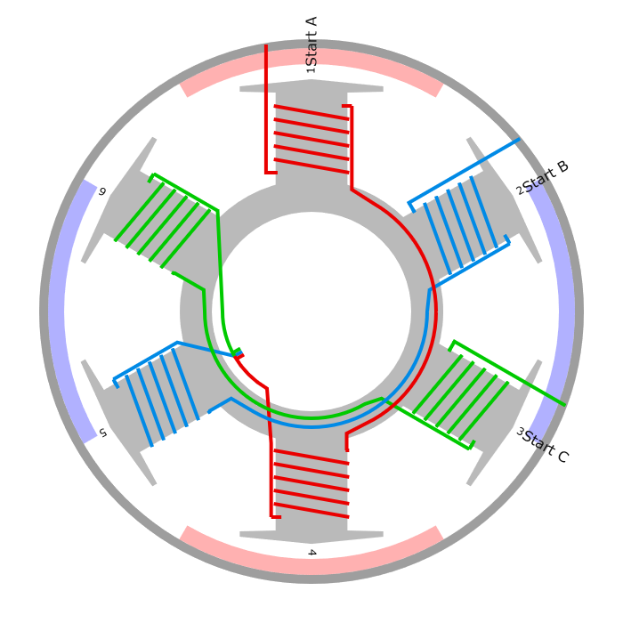
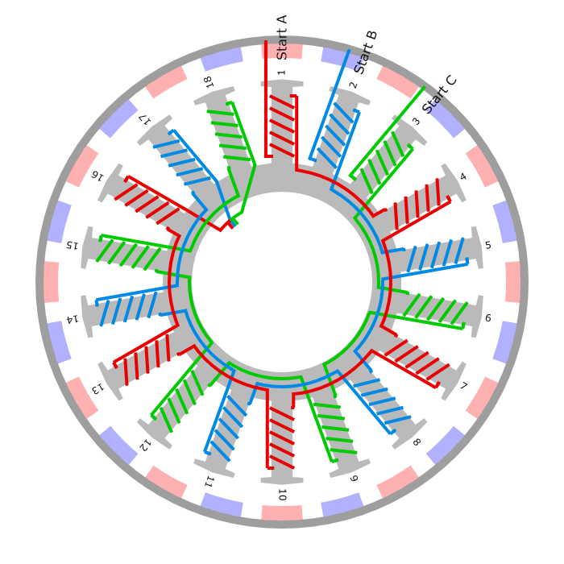
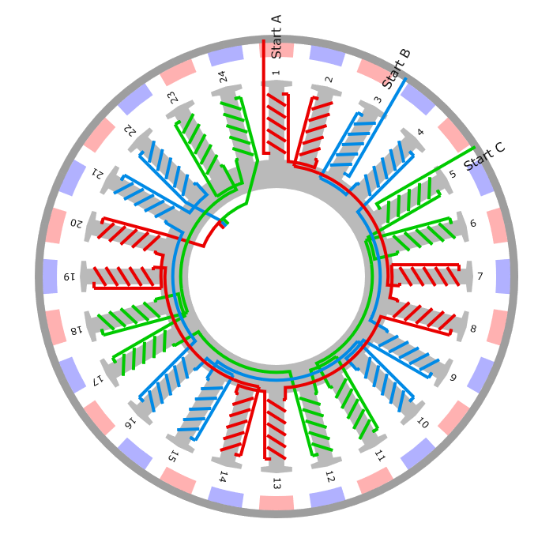
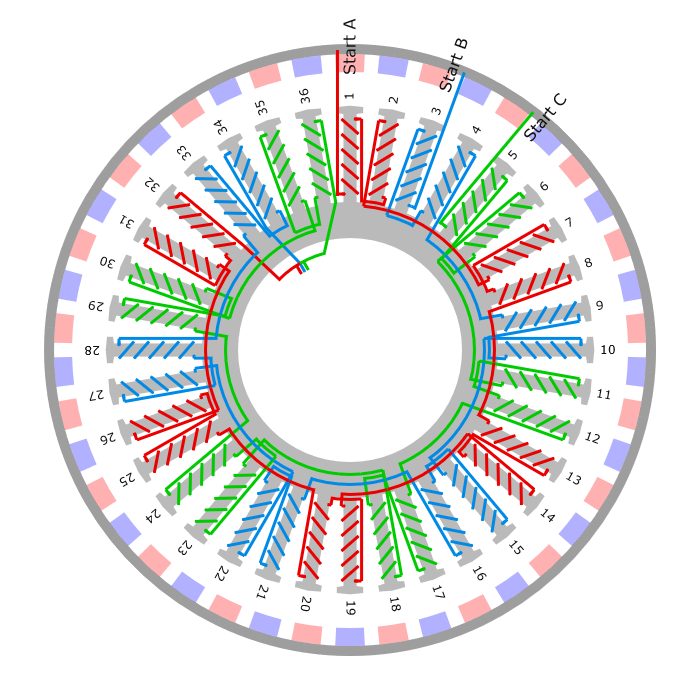

# Winding Scheme

The following pictures are generated using the Winding Scheme Calculator available at: https://www.bavaria-direct.co.za/scheme/calculator/

The python script `winding_scheme.py` is able to calculate the slot/magnet pole combination of any given configuration. The combinations are required to define new `motor_geometries` according to the updated framework and are calculated by finding the lowest common multiple of the number of slots and the number of magnets.

## Notes :

- https://www.electrical4u.com/winding-factor-pitch-factor-distribution-factor/

> Winding Factor is the product of the Distribution factor (Kd) and the coil span factor (Kc). The main purpose of the winding factor is to improve the rms generated voltage in a three-phase AC machine. [[ref]](https://www.electricalvolt.com/2021/11/winding-factor/)

> The ratio of phasor (vector) sum of induced emfs per coil to the arithmetic sum of induced emfs per coil is known as pitch factor (Kp) or coil span factor (Kc) which is always less than unity. [[ref]](https://uotechnology.edu.iq/dep-eee/lectures/3rd/Electrical/Machines%202/I_Introduction.pdf)

## Geometries added in this fork

    
    
    
    

